# DataRuler - AI-Powered Data Management Platform

A self-hosted, AI-powered data management and analytics platform. Upload any file type, get automatic processing, interactive dashboards, AI-generated reports, and chat with an AI assistant that understands your data.

**Cloud-only LLM inference** — no local GPU required. Uses free-tier cloud APIs (Groq, OpenRouter, HuggingFace).

## Features

- **Universal File Upload** — Drag & drop any file: CSV, Excel, PDF, JSON, databases, images, audio, video, archives, and 100+ more formats
- **Automatic Processing** — Files are detected, parsed, profiled, and stored in the optimal database engine
- **Smart Dashboards** — Auto-generated charts and insights, plus a drag-and-drop dashboard builder with chart, KPI, table, and text widgets
- **AI-Powered Reports** — Generate professional reports from your data using 5 templates (Executive Summary, Data Deep-Dive, Monthly Report, Comparison Report, Quick Brief) with real data-driven analysis
- **AI Chat Assistant** — Ask questions about your data in natural language; get SQL queries, charts, and answers
- **Multi-Agent Architecture** — 20 specialized AI agents with input/output contracts, execution metrics, dispatch timeouts, and dead letter tracking
- **File Manager** — Visual file browser with thumbnails, tags, search, and database/archive browsing
- **Notes System** — Markdown notes with auto-save, linked to files or standalone
- **Export** — Export dashboards and reports as JSON, export data as CSV, JSON, XLSX
- **Settings** — Profile management, AI model configuration, server-side storage monitoring, and bulk file reprocessing
- **Privacy First** — All data stays on your server. LLM calls go to free cloud APIs (Groq/OpenRouter/HuggingFace)

## Tech Stack

| Layer | Technology |
|-------|-----------|
| Frontend | Next.js 14 (App Router), React 18, Tailwind CSS, shadcn/ui, Radix UI |
| Charts | Apache ECharts |
| State | Zustand |
| Backend API | Next.js API Routes (BFF) + Python FastAPI (AI Service) |
| Database | SQLite (catalog + user data), DuckDB (OLAP analytics) |
| AI / LLM | Groq (free), OpenRouter (free), HuggingFace Inference API (free) |
| Embeddings | HuggingFace sentence-transformers |
| Auth | JWT + bcrypt, cookie-based sessions |
| Deployment | Docker Compose |

## Quick Start

```bash
git clone <repo-url>
cd data-ruler
cp .env.example .env
# Edit .env — add at least one API key (GROQ_API_KEY, OPENROUTER_API_KEY, or HF_API_TOKEN)
docker compose up --build -d
```

Open http://localhost:3000 and create an account.

Get a free API key from [Groq](https://console.groq.com/keys) (recommended), [OpenRouter](https://openrouter.ai/keys), or [HuggingFace](https://huggingface.co/settings/tokens).

## Deploy to a Domain

1. In `.env`, set `NEXTAUTH_URL=https://yourdomain.com` and generate a strong `NEXTAUTH_SECRET`
2. Point your domain's DNS A record to your server IP
3. Put a reverse proxy (e.g. [Caddy](https://caddyserver.com/) or Nginx) in front of port 3000 to handle HTTPS

## Environment Variables

```bash
# Required: at least ONE cloud LLM API key
GROQ_API_KEY=gsk_...          # Groq (recommended, fastest)
OPENROUTER_API_KEY=sk-or-...   # OpenRouter (most models)
HF_API_TOKEN=hf_...            # HuggingFace (embeddings + chat)

# Optional: model overrides
GROQ_CHAT_MODEL=llama-3.3-70b-versatile
GROQ_FAST_MODEL=llama-3.1-8b-instant
OPENROUTER_CHAT_MODEL=meta-llama/llama-3.3-70b-instruct:free

# Auth
NEXTAUTH_SECRET=your-secret-key-here

# Service URLs
AI_SERVICE_URL=http://localhost:8000
```

See `.env.example` for all options.

## Pages & UI

### Login (`/login`)

Centered authentication card on dark background. Email + password form with error handling and link to registration.

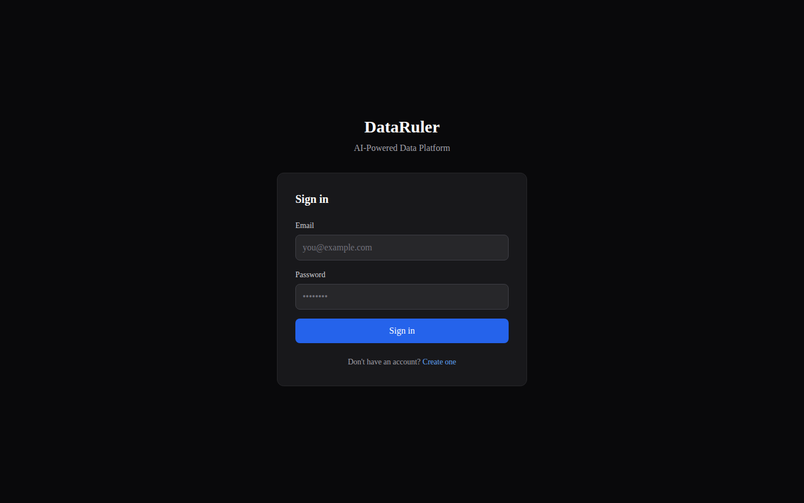

### Register (`/register`)

Account creation form with display name, email, password (8+ chars), and link to login.

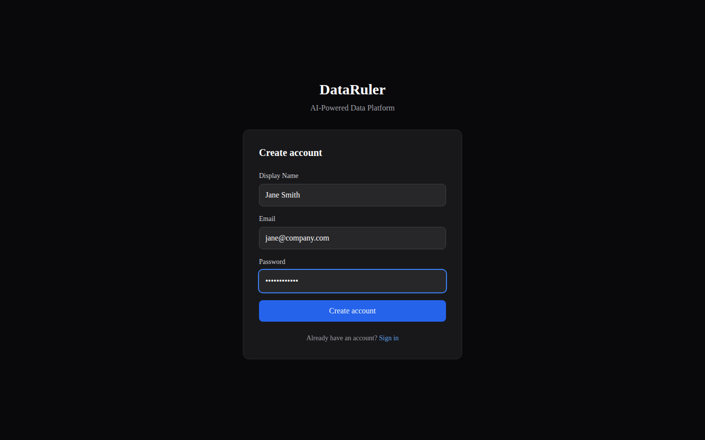

### Files (`/files`)

Main page after login. Collapsible sidebar, drag-and-drop upload zone, searchable file table with type/category badges, quality scores, status indicators, and bulk actions. Supports list and grid view modes with sorting and filtering.

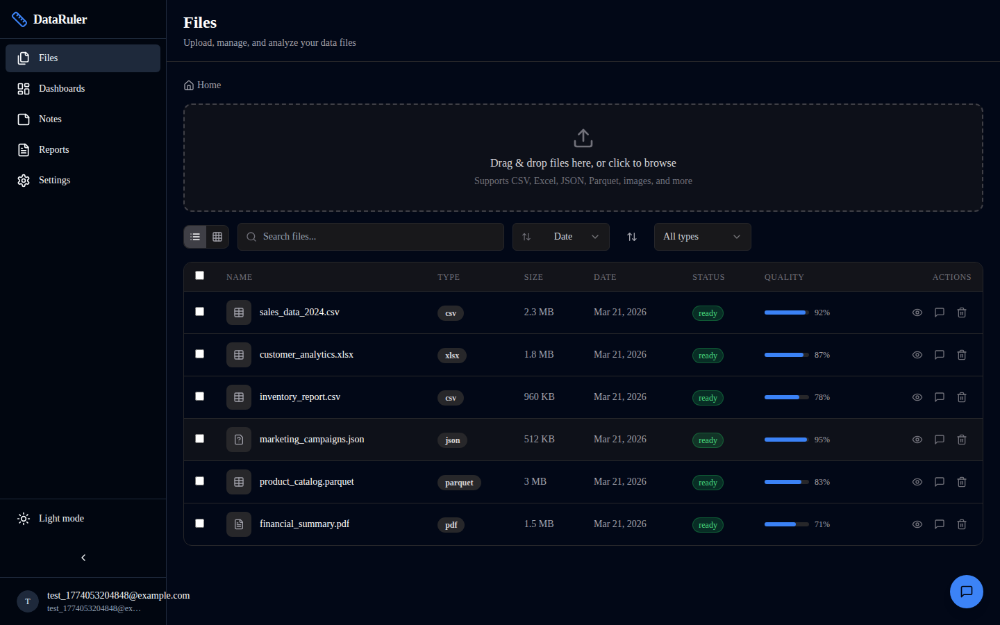

### Dashboards (`/dashboards`)

Grid of dashboard cards with "Create Dashboard" button. Cards show title, widget count, and last updated timestamp.

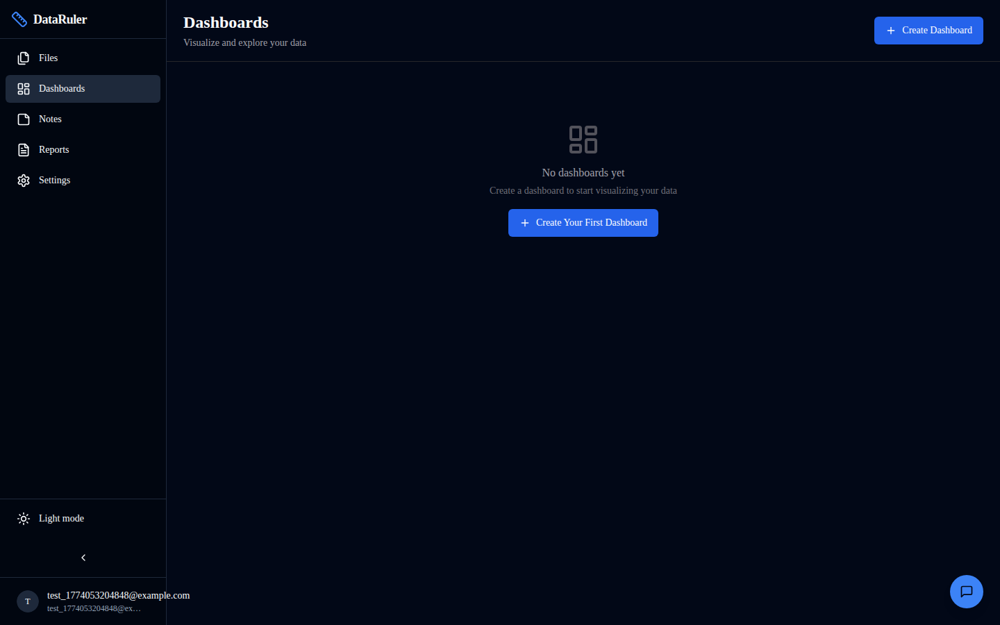

### Notes (`/notes`)

Two-panel layout. Left: searchable note list with file associations. Right: markdown editor with auto-save and delete.

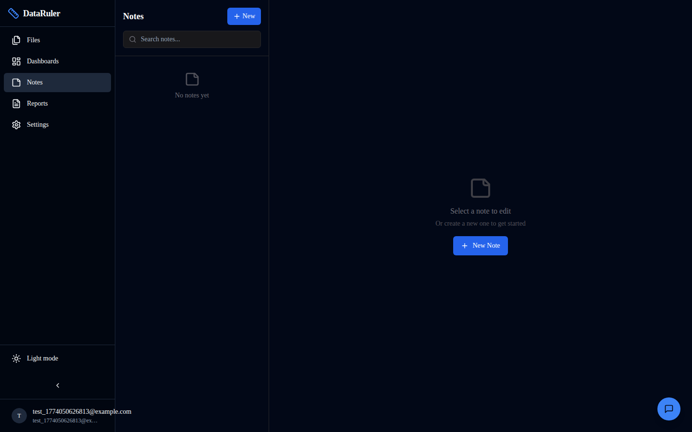

### Reports (`/reports`)

Full report management with 5 templates (Executive Summary, Data Deep-Dive, Monthly, Comparison, Quick Brief). Create reports from templates, select data sources, generate AI-powered analysis with real file metrics, and export as JSON. Search and filter by status.

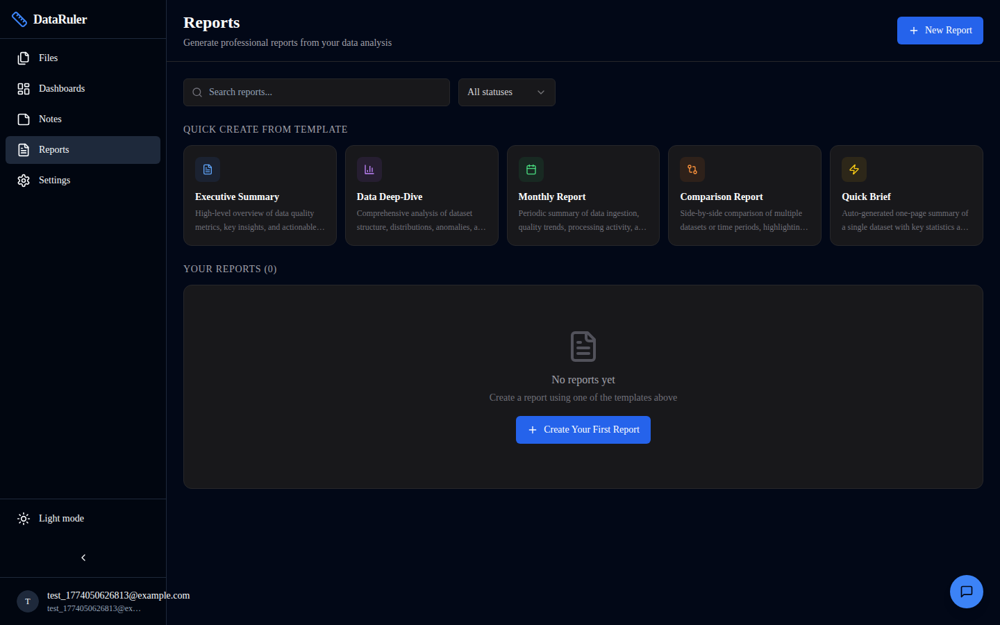

#### Executive Summary Report

High-level overview with KPI cards (total files, data volume, quality score, processing rate), data quality breakdown with per-file quality bars, and actionable recommendations for stakeholders.

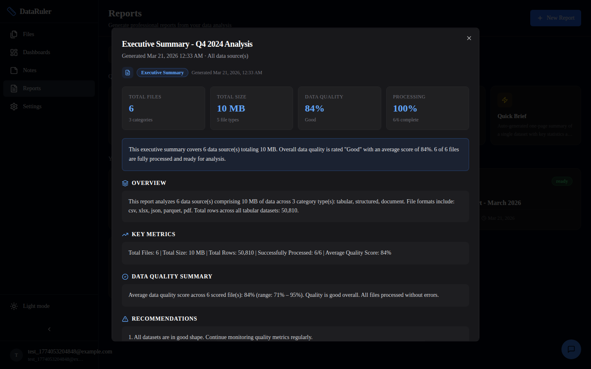

#### Data Deep-Dive Report

Comprehensive technical analysis with schema analysis table (columns, rows, size per dataset), size distribution visualization, anomaly detection findings, and correlation analysis across datasets.

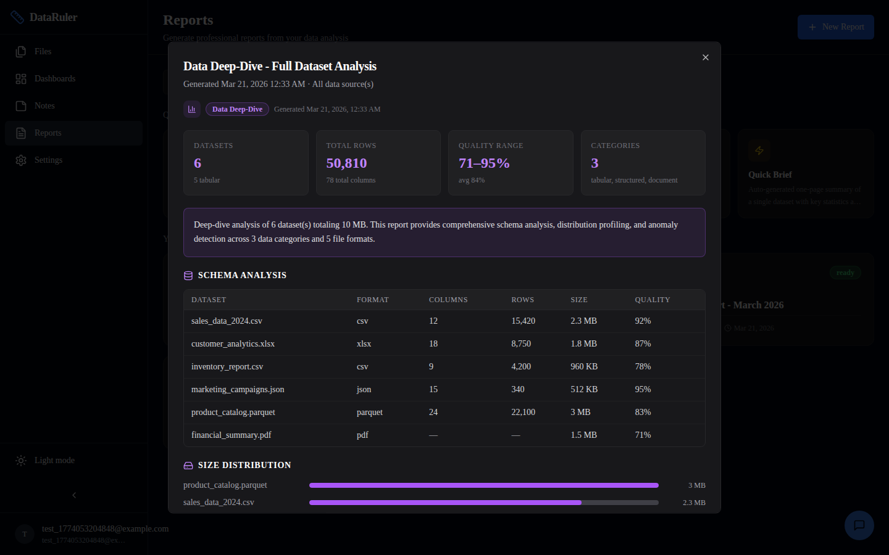

#### Monthly Report

Periodic activity summary with processing pipeline stats (ingested, processed, errors, pending), category breakdown table, quality trends, and month-over-month ingestion metrics.

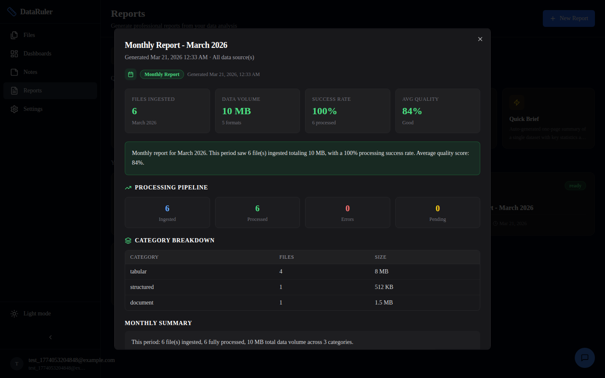

#### Comparison Report

Side-by-side dataset comparison table with format, category, size, rows, columns, quality, and status. Includes quality comparison bars, size and quality rankings, and statistical difference analysis.

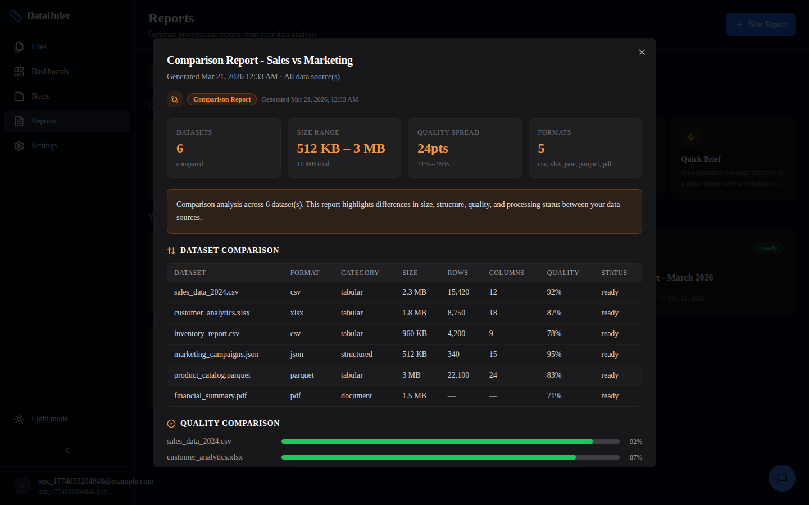

#### Quick Brief Report

One-page dataset summary with primary file snapshot (name, format, size, rows, columns, quality bar), AI-generated insights per file, and key statistics overview.

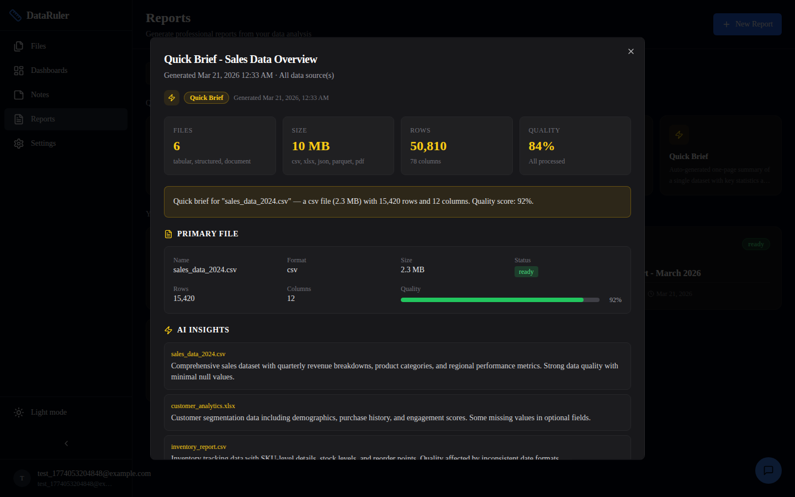

### Settings (`/settings`)

Profile management with server-persisted display name, dark/light theme toggle, AI model configuration (Ollama URL and model selection), server-side storage usage monitoring, cache clearing, and bulk file reprocessing.

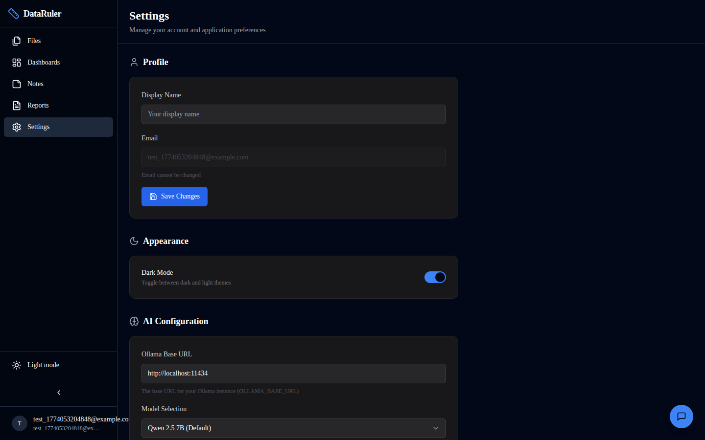

## API Contracts

### REST API — AI Service (FastAPI, port 8000)

#### Health & Status
```
GET  /health                     → System health, cloud LLM status, agent count
GET  /api/health                 → Same (alias)
```

#### Chat (Streaming SSE)
```
POST /api/chat/chat              → Stream AI chat response via orchestrator pipeline
     Body: { message, user_id, context_file_id?, context_id?, conversation_history[] }
     Response: SSE stream of { content, intent?, context_id? } chunks
```

#### File Processing Pipeline
```
POST /api/files/process          → Trigger async file processing
     Body: { file_id, user_id, file_path, original_name }
GET  /api/files/status/{file_id} → Get processing status
```

#### Agent Management & Observability
```
GET  /api/agents/                → List all agents with status and execution metrics
GET  /api/agents/metrics         → Aggregated metrics for all agents
GET  /api/agents/bus-stats       → Message bus stats + recent dead letters
GET  /api/agents/{name}          → Agent detail (contract, circuit state, token budget, metrics)
POST /api/agents/reset-circuit   → Reset circuit breaker for agent
```

#### Orchestration Pipelines
```
POST /api/pipelines/orchestrate  → Full LLM-powered orchestration
     Body: { message, user_id, file_id?, schema_context?, action? }
POST /api/pipelines/query        → Natural language → SQL query
     Body: { query, user_id, schema_context? }
POST /api/pipelines/analyze      → Run analytics pipeline
POST /api/pipelines/visualize    → Generate ECharts visualization
```

### REST API — Web BFF (Next.js, port 3000)

#### Auth
```
POST /api/auth/register          → Create account
POST /api/auth/login             → Login (sets auth-token cookie)
POST /api/auth/logout            → Logout
GET  /api/auth/me                → Current user
PUT  /api/auth/profile           → Update user profile (display name)
```

#### Files
```
GET    /api/files                → List user files (paginated, filterable)
POST   /api/files/upload         → Upload files (multipart)
GET    /api/files/{id}           → File details
PATCH  /api/files/{id}           → Update file metadata
DELETE /api/files/{id}           → Delete file
GET    /api/files/{id}/preview   → Preview file data
GET    /api/files/{id}/profile   → Data quality profile
```

#### Chat
```
POST /api/chat/message           → Send message (proxies to AI service, SSE)
GET  /api/chat/history           → Chat history
```

#### Dashboards
```
GET    /api/dashboards           → List dashboards
POST   /api/dashboards           → Create dashboard
GET    /api/dashboards/{id}      → Get dashboard with widgets
PUT    /api/dashboards/{id}      → Update dashboard
DELETE /api/dashboards/{id}      → Delete dashboard
```

#### Reports
```
GET    /api/reports              → List reports
POST   /api/reports              → Create report
GET    /api/reports/{id}         → Get report with content
PUT    /api/reports/{id}         → Update report
DELETE /api/reports/{id}         → Delete report
POST   /api/reports/{id}/generate → Generate report content from file data
```

#### Notes
```
GET    /api/notes                → List notes
POST   /api/notes                → Create note
GET    /api/notes/{id}           → Get note
PUT    /api/notes/{id}           → Update note
DELETE /api/notes/{id}           → Delete note
```

#### Settings & Processing
```
GET  /api/settings/storage       → Server-side storage usage metrics
POST /api/processing/reprocess   → Queue all files for reprocessing
GET  /api/processing/queue       → Processing task queue status
POST /api/data/query             → Execute SQL against user data
POST /api/export/data            → Export data in various formats
```

## Database Schema

### Catalog Database (catalog.db)

```sql
-- Users table
users (id, email, password_hash, display_name, settings, created_at)

-- File registry with full metadata
files (id, user_id, original_name, stored_path, file_type, file_category,
       mime_type, size_bytes, content_hash, storage_backend, db_table_name,
       schema_snapshot, row_count, column_count, processing_status,
       quality_profile, quality_score, ai_summary, tags, created_at)

-- Imported table registry
imported_tables (id, file_id, table_name, schema_snapshot, row_count)

-- Cross-file relationships
file_relationships (id, file_id_a, file_id_b, relationship_type,
                    column_a, column_b, confidence, confirmed_by_user)

-- Dashboards with widget configs
dashboards (id, user_id, title, description, layout, widgets, is_auto_generated)

-- AI-generated reports
reports (id, user_id, title, description, template, status, file_ids, content, config)

-- Markdown notes
notes (id, user_id, file_id, title, content, content_format)

-- Chat history
chat_messages (id, user_id, role, content, context_file_id, metadata)

-- Processing task queue
processing_tasks (id, user_id, file_id, task_type, status, agent_name, result)

-- Agent performance logs
agent_logs (id, agent_name, task_type, latency_ms, token_count, success)
```

### User Data Database (per-user, {user_id}/user_data.db)

Each uploaded tabular file gets its own table: `file_{file_id}` with all columns stored as TEXT for maximum compatibility. Schema inference metadata is stored in the catalog.

## Multi-Agent Architecture

DataRuler uses 20 specialized AI agents coordinated by an LLM-powered orchestrator. This section explains how they work together.

### Request Lifecycle

All requests — including chat — flow through the orchestrator pipeline. The orchestrator determines intent, builds an execution plan, dispatches agents in parallel groups with session context, and synthesizes results via LLM.

```
HTTP Request (user message, file upload, query)
     │
     ▼
┌──────────────────┐
│  FastAPI Router   │  /api/chat, /api/files/process, /api/pipelines/*
└────────┬─────────┘
         │
         ▼
┌──────────────────┐     ┌──────────────────┐
│   Orchestrator    │────▶│  Cloud LLM (Groq)│  temperature=0.1
│   Agent           │◄────│  json_mode=true  │  max_tokens=512
└────────┬─────────┘     └──────────────────┘
         │
         │  Session context (ContextStore)
         │  + Execution plan JSON:
         │  { intent, confidence, plan: [{agent, parallel_group}], reasoning }
         │
         ▼
┌──────────────────────────────────────────────────────┐
│  Parallel Execution Engine (with dispatch timeouts)   │
│                                                       │
│  Group 0 ──▶ [validation_security] ──────────────────│──▶ accumulate context
│  Group 1 ──▶ [file_detection, schema_inference]  ────│──▶ accumulate context
│  Group 2 ──▶ [analytics, visualization]  ────────────│──▶ accumulate context
│  Group 3 ──▶ [storage_router]  ──────────────────────│──▶ accumulate context
│                                                       │
│  Groups run sequentially (0→1→2→3)                    │
│  Steps WITHIN a group run concurrently (asyncio.gather)│
│  Failed agents don't block other agents in the group  │
└────────┬─────────────────────────────────────────────┘
         │
         ▼
┌──────────────────┐
│  Result Synthesis │  LLM combines all agent outputs into final response
└────────┬─────────┘
         │
         ▼
    HTTP Response (streamed SSE or JSON)
```

### Agent Communication Protocol

All inter-agent communication uses the `AgentMessage` envelope:

```python
AgentMessage:
  message_id:     UUID        # Unique message identifier
  correlation_id: UUID        # Tracks request/reply chains
  type:           REQUEST | RESPONSE | ERROR | STATUS
  source_agent:   str         # Sender agent name
  target_agent:   str         # Recipient agent name
  priority:       LOW(0) | NORMAL(1) | HIGH(2) | CRITICAL(3)
  payload:        dict        # Arbitrary data (input params, results, errors)
  ttl:            int         # Time-to-live in seconds
  created_at:     datetime    # Timestamp
```

### Agent Contracts

Each agent declares an `AgentContract` specifying its required/optional inputs and guaranteed output keys. The base class validates contracts at dispatch time, returning clear error messages when required inputs are missing.

```python
AgentContract:
  required_inputs: tuple[str, ...]   # Keys the agent expects in the payload
  optional_inputs: tuple[str, ...]   # Keys the agent can use but doesn't require
  output_keys:     tuple[str, ...]   # Keys guaranteed in the response on success
```

### Message Bus

The message bus provides async pub/sub with priority-based dispatch:

- **Target-based routing** — Messages routed to `target_agent` via registered subscriber callbacks
- **Priority queue** — `asyncio.PriorityQueue` dequeues highest-priority messages first
- **Request/reply** — `correlation_id` maps to `asyncio.Future` for blocking await with timeout (default 30s)
- **Fan-out** — Multiple subscribers can register for the same agent (all receive the message)
- **TTL enforcement** — Messages past their TTL are moved to the dead letter queue instead of being delivered
- **Dead letter queue** — Undeliverable and expired messages are captured with reason codes for operational visibility (`GET /api/agents/bus-stats`)

### Orchestrator Decision Logic

The orchestrator has two paths for deciding which agents to invoke:

**Path A — LLM Intent Parsing** (primary):
1. Constructs prompt with user message + file context + schema context + session state
2. Calls LLM with `json_mode=True`, `temperature=0.1` (deterministic)
3. Returns structured JSON plan

**Path B — Keyword Fallback** (when LLM parsing fails):

| Keywords | Intent | Agents |
|----------|--------|--------|
| `query`, `select`, `sql`, `count`, `average` | query_data | sql_agent |
| `chart`, `plot`, `graph`, `visualize` | visualize | analytics → visualization |
| `analyze`, `statistics`, `profile` | analyze_data | schema_inference + analytics → visualization |
| `export`, `download`, `save as` | export | export_agent |
| `relationship`, `foreign key`, `join` | find_relationships | relationship_mining |
| `upload`, `process`, `import` | process_file | validation + detection → schema → storage |
| _(anything else)_ | general_chat | document_qa |

### Parallel Execution Engine

Groups execute **sequentially** (group 0 finishes before group 1 starts). Steps **within** a group run **concurrently** via `asyncio.gather`. Failed agents within a parallel group do not block other agents in the same group.

### Circuit Breaker

Per-agent fault tolerance prevents cascading failures:

```
    CLOSED (normal operation)
        │
        │ failure_count >= 5 (within 10-min window)
        ▼
      OPEN (all calls rejected immediately)
        │
        │ 60 seconds elapsed
        ▼
    HALF_OPEN (allow exactly 1 probe request)
       ╱ ╲
  success   failure
     │         │
     ▼         ▼
   CLOSED     OPEN
```

- **Threshold**: 5 failures within a 10-minute rolling window
- **Recovery timeout**: 60 seconds before probing

### Token Budget Manager

Two-level budget model prevents runaway LLM costs:

- **Global Budget**: 2,000,000 tokens/hour (all agents combined)
- **Per-Agent Budget**: 400,000 tokens/hour each
- **Rolling window**: 1-hour sliding window with lazy pruning
- **Pre-check**: `has_budget(agent_name)` called before dispatch — if exhausted, agent is skipped

### Context Store

Per-session shared state enables agents to collaborate without direct coupling:

- **Table Registry** — Agents register imported tables with schema info
- **Relationship Graph** — Discovered foreign keys with confidence scores
- **File Catalog** — Shared file metadata accessible to all agents
- **Cache** — Arbitrary key-value store for intermediate results

### 20 Specialized Agents

| Agent | Purpose | Uses LLM? |
|-------|---------|-----------|
| **orchestrator** | LLM-powered intent parsing, execution planning | Yes |
| **file_detection** | Magic bytes + extension-based file type detection | No |
| **tabular_processor** | CSV, XLSX, Parquet, TSV, ODS parsing + import | No |
| **document_processor** | PDF, DOCX, PPTX, TXT, HTML text extraction | No |
| **database_importer** | SQLite, DuckDB, SQL dump importing | No |
| **media_processor** | Image metadata, thumbnails, audio/video info | No |
| **archive_processor** | ZIP, TAR, GZIP extraction (safe, with limits) | No |
| **structured_data** | JSON, XML, YAML, TOML, INI parsing + flattening | No |
| **specialized_format** | GeoJSON, Shapefile, HDF5, NetCDF processing | No |
| **schema_inference** | Column type inference + data quality scoring | Yes |
| **relationship_mining** | Foreign key + joinable column discovery | Yes |
| **storage_router** | Route data to SQLite/DuckDB/filesystem | No |
| **analytics** | Statistical analysis + anomaly detection | Yes |
| **visualization** | ECharts config generation from data | Yes |
| **sql_agent** | Natural language → SQL generation + execution | Yes |
| **document_qa** | RAG-based Q&A over extracted document text | Yes |
| **cross_modal** | Cross-format queries spanning multiple files | Yes |
| **export_agent** | Data export (CSV, JSON, XLSX, Markdown) | No |
| **validation_security** | File security validation + integrity hashing | No |
| **scheduler** | Recurring task execution with background asyncio loops | No |

## Project Structure

```
data-ruler/
├── apps/
│   ├── web/                        # Next.js frontend + BFF API
│   │   ├── app/                    # Pages (auth, dashboard, files, notes, reports, settings)
│   │   ├── app/api/                # 30+ API routes
│   │   ├── components/             # 30+ UI components (shadcn/ui based)
│   │   ├── stores/                 # 6 Zustand stores (auth, chat, files, dashboard, notes, reports)
│   │   └── lib/                    # DB, auth, utils
│   │
│   └── ai-service/                 # Python FastAPI AI backend
│       ├── agents/                 # 20 specialized AI agents
│       ├── core/                   # Agent base, message bus, circuit breaker, token budget, registry
│       ├── services/               # Cloud LLM client, embeddings, RAG, parsers, storage backends
│       ├── routers/                # 5 API routers (health, chat, files, agents, pipelines)
│       └── models/                 # Pydantic schemas (15+ models)
│
├── data/                           # Runtime data (gitignored)
├── scripts/                        # Utility scripts (screenshot generation)
├── docker-compose.yml              # Cloud-only (no local Ollama)
├── start.sh                        # One-command startup
└── .env.example                    # Configuration template
```

## License

See LICENSE file.
